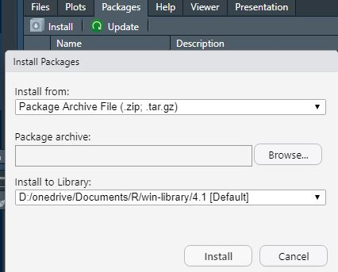

```{r, include = FALSE}
knitr::opts_chunk$set(
  collapse = TRUE,
  comment = "#>"
)
```


# Introduction

This should serve to document a new set of functions developed for REGACC to load different kind of data sets into R. Ad-hoc created functions were used in the past in several scripts. This more generic functions were developed to be re-used centrally and reduce the code duplication. They are also more user-friendly for final users that do not need to look at different parts of the code to change parameters. With some modifications, remember the almost!, they could be easily modify to work with other National Accounts data sets.

# Basic Information and Getting Started

The file with the R-package that includes the functions is stored in [U:\\03_Regional Accounts\\03D_Data Production\\2022\R\functions]. In order to use them it is needed to install the package. This can be done in two ways:

```{r, eval= TRUE}
# install.packages("devtools")
devtools::install_github("Luisbia/luispack")
```

Or selecting install packages in R and pointing towards the file in [U:\\03_Regional Accounts\\03D_Data Production\\2022\R\functions].

source("U:/03_Regional Accounts/03D_Data Production/2022/R/functions/")

After that we just need to load the library and all the functions become available.

# `regacc_load_xml()`

This function loads xml files into R. We may want to do that to look at files before loading them with FameFeed or for other purposes. The function will look by default on the server folder for all countries and all tables but that can be changed by the user using the arguments of the function. The function does not search into sub-folders of the provided path. Other options are to filter the files created after or before a certain date (current defaults is 2021-10-01 and 2099-01-01) and if the data should be consolidated. Consolidation means that if some information is the same in several files only the provided first is kept. The unit multiplier is changed if needed to be consistent with the one used by default elsewhere.

## Examples

Load all the files waiting to be loaded to FameFeed in the server.

```{r, eval=FALSE}
df <- regacc_load_xml()
```

Load only table T1001.

```{r,eval=FALSE}
df <- regacc_load_xml(table_sel = "T1001")
```

Load all tables T1001 and T1300 for Slovenia and Luxembourg that have been loaded in Matis.

```{r, eval=FALSE}
df <- regacc_load_xml(folder = "//fame2prod.cc.cec.eu.int/fame-estat/econ/REGACC/DONE",
                      table_sel = c("T1001","T1300"),
                      country_sel = c("SI", "LU"))
```

Load all files loaded in Matis between 2021-12-22 2022-01-02 and consolidate them.

```{r, eval = FALSE}
df <- regacc_load_xml(folder = "//fame2prod.cc.cec.eu.int/fame-estat/econ/REGACC/DONE",
                      min_time = "2021-12-22",
                      max_time = "2022-01-02"
                      consolidate = TRUE)
```

# `regacc_load_csv()`

This function is very similar to `regacc_load_xml()` and have the same arguments but works with csv files. The only noticeable difference is that it will ignore all fields that include qualitative information (flags, comments). It should be used when we are mainly interested in loading a big amount of files (csvs are read faster than xml) to do some numerical analysis.


